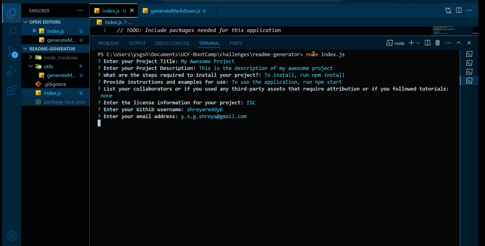

# Readme generator

## Description

A Readme generator to generate the README.md file.

## Installation

To install this, clone the repository from github.

## Usage

The Readme generator helps in generating a README.md file for you project when the user answers the questions in the prompt.

## Screenshots

The following screenshots shows the readme genrator's appearance

## Codebase

You can find the project repository [here](https://github.com/shreyareddy6/readme-generator.git)

## Credits

NA

## License

Please refer to the LICENSE in the repo.
